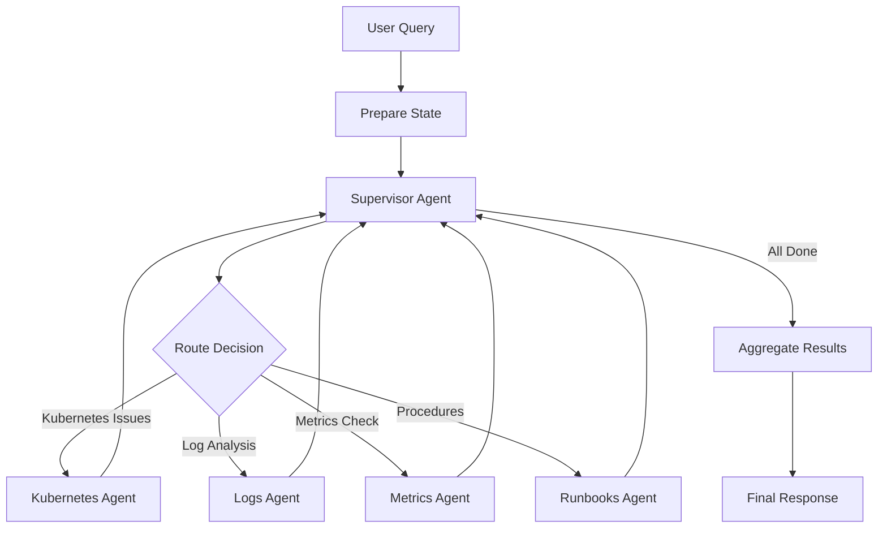

# Amazon SRE Agent - Manjunath Branch: Complete Technical Documentation

## Table of Contents
1. [Project Overview](#project-overview)
2. [Architecture](#architecture)
3. [Core Components](#core-components)
4. [File-by-File Explanation](#file-by-file-explanation)
5. [Workflow Examples](#workflow-examples)
6. [Data Flow](#data-flow)
7. [Key Technologies](#key-technologies)

---

## Project Overview

The **Amazon SRE Agent** is a sophisticated **multi-agent system** designed to help Site Reliability Engineers (SREs) investigate and troubleshoot infrastructure issues. Built on the **Model Context Protocol (MCP)** and powered by AI models (Amazon Nova and Anthropic Claude), this system uses specialized AI agents that collaborate to analyze problems, investigate logs, monitor metrics, and execute operational procedures.

### Key Characteristics:
- **Multi-Agent Architecture**: 5 specialized agents working together
- **MCP-Based Tool Access**: Uses AgentCore Gateway for secure API access
- **Real-time Streaming**: Live updates during investigations
- **Memory-Enabled**: Remembers user preferences and past investigations
- **Production-Ready**: Can be deployed on Amazon Bedrock AgentCore Runtime

---

## Architecture

### High-Level System Design

```
┌─────────────────────────────────────────────────────────────────┐
│                         CLI/UI Layer                             │
│  (sre_agent/cli.py, sre_agent/multi_agent_langgraph.py)         │
└────────────────────────────┬────────────────────────────────────┘
                             │
                             ▼
┌─────────────────────────────────────────────────────────────────┐
│                    Multi-Agent Graph                             │
│              (sre_agent/graph_builder.py)                        │
│                                                                   │
│  ┌──────────────────────────────────────────────────────────┐  │
│  │             Supervisor Agent                              │  │
│  │         (sre_agent/supervisor.py)                         │  │
│  │  - Plans investigations                                   │  │
│  │  - Routes to specialist agents                            │  │
│  │  - Aggregates results                                     │  │
│  └───────────────────┬──────────────────────────────────────┘  │
│                      │                                           │
│      ┌───────────────┼───────────────┬────────────────┐        │
│      ▼               ▼               ▼                ▼        │
│  ┌────────┐    ┌────────┐    ┌────────┐      ┌────────┐      │
│  │ K8s    │    │ Logs   │    │Metrics │      │Runbooks│      │
│  │ Agent  │    │ Agent  │    │ Agent  │      │ Agent  │      │
│  └────┬───┘    └────┬───┘    └────┬───┘      └────┬───┘      │
│       │             │              │                │           │
└───────┼─────────────┼──────────────┼────────────────┼──────────┘
        │             │              │                │
        └─────────────┴──────────────┴────────────────┘
                             │
                             ▼
┌─────────────────────────────────────────────────────────────────┐
│              AgentCore Gateway (MCP Protocol)                    │
│            (Provides MCP tools via HTTPS)                        │
└────────────────────────────┬────────────────────────────────────┘
                             │
                             ▼
┌─────────────────────────────────────────────────────────────────┐
│                    Backend API Servers                           │
│              (backend/servers/*.py)                              │
│                                                                   │
│  ┌──────────┐  ┌──────────┐  ┌──────────┐  ┌──────────┐       │
│  │   K8s    │  │  Logs    │  │ Metrics  │  │ Runbooks │       │
│  │  Server  │  │  Server  │  │  Server  │  │  Server  │       │
│  │  :8011   │  │  :8012   │  │  :8013   │  │  :8014   │       │
│  └────┬─────┘  └────┬─────┘  └────┬─────┘  └────┬─────┘       │
│       │             │              │              │              │
└───────┼─────────────┼──────────────┼──────────────┼──────────────┘
        │             │              │              │
        ▼             ▼              ▼              ▼
┌─────────────────────────────────────────────────────────────────┐
│                   Mock Data Storage                              │
│              (backend/data/*)                                    │
│  - k8s_data/: pods, nodes, deployments, events                  │
│  - logs_data/: log patterns, counts                             │
│  - metrics_data/: performance, errors, availability             │
│  - runbooks_data/: playbooks, procedures, guides                │
└─────────────────────────────────────────────────────────────────┘
```

### Agent Flow Diagram



---

## Core Components

### 1. **Entry Point & CLI** (`sre_agent/cli.py`)
- Simple wrapper that launches the multi-agent system
- Entry point for the `sre-agent` command
- Delegates to `multi_agent_langgraph.py`

### 2. **Main Orchestrator** (`sre_agent/multi_agent_langgraph.py`)
- **Purpose**: Main application logic and user interaction
- **Key Functions**:
  - `main()`: Parses command-line arguments, configures logging
  - `create_multi_agent_system()`: Initializes agents and MCP tools
  - `_run_interactive_session()`: Handles multi-turn conversations
  - Creates MCP client to connect to backend services
- **Modes**:
  - **Prompt Mode**: Single query execution
  - **Interactive Mode**: Multi-turn conversation with commands

### 3. **Graph Builder** (`sre_agent/graph_builder.py`)
- **Purpose**: Constructs the multi-agent collaboration graph using LangGraph
- **Key Functions**:
  - `build_multi_agent_graph()`: Creates the state graph with all agents
  - `_route_supervisor()`: Routes from supervisor to specialist agents
  - `_should_continue()`: Determines if workflow should continue
- **Graph Structure**:
  ```
  prepare → supervisor → [k8s/logs/metrics/runbooks] → supervisor → aggregate → END
  ```

### 4. **Supervisor Agent** (`sre_agent/supervisor.py`)
- **Purpose**: Orchestrates investigations and coordinates specialist agents
- **Key Responsibilities**:
  - Creates investigation plans (3-5 steps)
  - Routes queries to appropriate specialist agents
  - Aggregates results from multiple agents
  - Formats final responses
- **Key Methods**:
  - `route()`: Decides which agent to invoke next
  - `aggregate_responses()`: Combines all agent findings
  - `_create_investigation_plan()`: Plans multi-step investigations

### 5. **Specialist Agents** (`sre_agent/agent_nodes.py`)
- **Four Domain-Specific Agents**:
  1. **Kubernetes Agent**: Pod status, deployments, cluster events, resource usage
  2. **Logs Agent**: Log search, error analysis, pattern detection
  3. **Metrics Agent**: Performance metrics, error rates, availability
  4. **Runbooks Agent**: Incident playbooks, troubleshooting guides, escalation procedures
- **Implementation**: Each agent is a ReAct (Reasoning + Acting) agent with:
  - System prompt (from `config/prompts/`)
  - Filtered tool set (specific to their domain)
  - LLM for reasoning and tool invocation

### 6. **Agent State** (`sre_agent/agent_state.py`)
- **Purpose**: Defines the shared state structure passed between agents
- **Key Fields**:
  - `messages`: Conversation history
  - `next`: Which agent to invoke next
  - `agent_results`: Results from each agent
  - `current_query`: Current question being investigated
  - `metadata`: Additional context and flags
  - `user_id`, `session_id`: For memory and personalization
  - `final_response`: Aggregated output

### 7. **Constants** (`sre_agent/constants.py`)
- **Purpose**: Centralized configuration management using Pydantic models
- **Configuration Categories**:
  - `ModelConfig`: LLM model IDs, temperature, max tokens
  - `AWSConfig`: AWS region, endpoints
  - `TimeoutConfig`: Execution timeouts
  - `PromptConfig`: Prompt file paths
  - `ApplicationConfig`: Output directories, spinner chars
  - `AgentsConstant`: Agent metadata and actor IDs
  - `MemoryConfig`: Memory system settings

### 8. **Backend Servers** (`backend/servers/`)
- **Purpose**: Provide mock APIs simulating real SRE data sources
- **Four FastAPI Servers**:
  1. `k8s_server.py` (Port 8011): Kubernetes data
  2. `logs_server.py` (Port 8012): Application logs
  3. `metrics_server.py` (Port 8013): Performance metrics
  4. `runbooks_server.py` (Port 8014): Operational procedures
- **Features**:
  - API key authentication
  - Serves mock JSON data from `backend/data/`
  - OpenAPI/Swagger documentation at `/docs`
  - Health check endpoints

### 9. **MCP Integration**
- **Model Context Protocol**: Standard for exposing tools to AI agents
- **Client**: `MultiServerMCPClient` connects to AgentCore Gateway
- **Transport**: Uses `streamable_http` for MCP over HTTPS
- **Tools**: Backend APIs exposed as MCP tools via Gateway

---

## File-by-File Explanation

### **Root Directory Files**

#### `README.md`
- **Purpose**: Main project documentation
- **Content**: Setup instructions, deployment guide, usage examples
- **Key Sections**: Prerequisites, installation, execution, production deployment

#### `pyproject.toml`
- **Purpose**: Python project configuration and dependencies
- **Key Dependencies**:
  - `langgraph`: Multi-agent orchestration framework
  - `langchain-*`: LLM integrations and tools
  - `langchain-mcp-adapters`: MCP protocol support
  - `fastapi`, `uvicorn`: Backend API servers
  - `boto3`: AWS SDK for Bedrock
  - `bedrock-agentcore`: AgentCore SDK
- **Scripts**: Defines `sre-agent` CLI command

#### `Makefile`
- **Purpose**: Developer workflows and quality checks
- **Targets**:
  - `quality`: Runs all checks (format, lint, typecheck, security)
  - `format`: Black code formatting
  - `lint`: Ruff linting
  - `typecheck`: MyPy type checking
  - `security`: Bandit security scanning
  - `test`: PyTest test execution
  - `clean`: Remove build artifacts

#### `Dockerfile`
- **Purpose**: Container image for AgentCore Runtime deployment
- **Key Steps**:
  1. Uses Python 3.12 base image
  2. Installs `uv` package manager
  3. Copies and installs dependencies
  4. Exposes port 8080
  5. Runs FastAPI server with OpenTelemetry instrumentation

### **`sre_agent/` Directory** (Main Agent Code)

#### `cli.py`
- **Lines**: 25 lines
- **Purpose**: Entry point for CLI command
- **Execution**: `sre-agent --prompt "your query"` → `cli.py:main()` → `multi_agent_langgraph.py:main()`

#### `multi_agent_langgraph.py`
- **Lines**: ~1449 lines (largest file)
- **Purpose**: Core application orchestration
- **Key Functions**:
  - `main()`: Entry point, argument parsing, mode selection
  - `create_multi_agent_system()`: Sets up agents and tools
  - `create_mcp_client()`: Connects to backend via MCP
  - `_run_interactive_session()`: Interactive conversation loop
  - `_save_final_response_to_markdown()`: Saves reports
- **Command-line Arguments**:
  - `--provider`: Choose LLM (groq/anthropic/bedrock)
  - `--prompt`: Single query mode
  - `--interactive`: Multi-turn conversation mode
  - `--debug`: Enable debug logging
  - `--output-dir`: Report save location

#### `graph_builder.py`
- **Lines**: ~210 lines
- **Purpose**: Constructs the LangGraph state machine
- **Key Functions**:
  - `build_multi_agent_graph()`: Creates and compiles the graph
  - `_route_supervisor()`: Maps supervisor decisions to agents
  - `_should_continue()`: Loop prevention logic
  - `_prepare_initial_state()`: Sets up initial query state
- **Graph Nodes**:
  - `prepare`: Initialize state
  - `supervisor`: Plan and route
  - `kubernetes_agent`, `logs_agent`, `metrics_agent`, `runbooks_agent`: Specialists
  - `aggregate`: Combine results

#### `supervisor.py`
- **Lines**: ~600+ lines
- **Purpose**: Investigation planning and coordination
- **Key Classes**:
  - `SupervisorAgent`: Main coordinator
  - `InvestigationPlan`: Pydantic model for plans
  - `RouteDecision`: Pydantic model for routing
- **Workflow**:
  1. Receives user query
  2. Creates investigation plan (steps + agent sequence)
  3. Routes to first agent
  4. Collects results
  5. Routes to next agent or aggregates
- **Prompts Used**:
  - `supervisor_multi_agent_prompt.txt`: Main routing logic
  - `supervisor_planning_prompt.txt`: Plan creation
  - `supervisor_*_aggregation.txt`: Result synthesis

#### `agent_nodes.py`
- **Lines**: ~300+ lines
- **Purpose**: Defines the four specialist agents
- **Key Classes**:
  - `BaseAgentNode`: Common agent functionality
  - Each agent inherits from this base
- **Key Functions**:
  - `create_kubernetes_agent()`
  - `create_logs_agent()`
  - `create_metrics_agent()`
  - `create_runbooks_agent()`
  - `_filter_tools_for_agent()`: Restricts tools per agent
- **Agent Creation**:
  ```python
  agent = create_react_agent(llm, filtered_tools)
  ```

#### `agent_state.py`
- **Lines**: ~65 lines
- **Purpose**: TypedDict defining shared state structure
- **Key Fields**:
  - `messages`: Message history with `add_messages` annotation
  - `next`: Routing decision
  - `agent_results`: Dictionary of agent outputs
  - `metadata`: Investigation context
  - `user_id`, `session_id`: Identity tracking

#### `constants.py`
- **Lines**: ~381 lines
- **Purpose**: Centralized configuration using Pydantic
- **Configuration Models**:
  - `ModelConfig`: Model IDs, parameters
  - `AWSConfig`: Region, endpoints
  - `TimeoutConfig`: Execution limits
  - `PromptConfig`: Prompt file mappings
  - `ApplicationConfig`: App settings
  - `AgentsConstant`: Agent metadata
  - `MemoryConfig`: Memory settings
- **Usage**: `from .constants import SREConstants`
- **Access**: `SREConstants.model.anthropic_model_id`

#### `llm_utils.py`
- **Purpose**: LLM provider abstraction and error handling
- **Key Functions**:
  - `create_llm_with_error_handling()`: Factory for LLM instances
  - Supports: Anthropic, Bedrock, Groq
  - Custom exceptions: `LLMAuthenticationError`, `LLMAccessError`, `LLMProviderError`

#### `prompt_loader.py`
- **Purpose**: Loads and manages prompt templates
- **Key Functions**:
  - `get_agent_prompt()`: Retrieves agent-specific prompts
  - `get_supervisor_prompt()`: Retrieves supervisor prompts
  - Uses LRU caching for performance

#### `output_formatter.py`
- **Purpose**: Formats agent outputs for readability
- **Key Functions**:
  - `create_formatter()`: Creates output formatting utilities
  - Converts technical findings to user-friendly text

#### `logging_config.py`
- **Purpose**: Centralized logging configuration
- **Key Functions**:
  - `configure_logging()`: Sets up log handlers and levels
  - `should_show_debug_traces()`: Controls debug output

### **`sre_agent/config/` Directory**

#### `agent_config.yaml`
- **Purpose**: Maps agents to their allowed tools
- **Structure**:
  ```yaml
  agents:
    kubernetes_agent:
      tools: [get_pod_status, get_deployment_status, ...]
    logs_agent:
      tools: [search_logs, get_error_logs, ...]
    metrics_agent:
      tools: [get_performance_metrics, ...]
    runbooks_agent:
      tools: [search_runbooks, get_incident_playbook, ...]
  global_tools:
    - x-amz-bedrock-agentcore-search
  gateway:
    uri: "https://..."
  ```

#### `config/prompts/` Directory
Contains 15+ prompt template files:

1. **`agent_base_prompt.txt`**
   - Base instructions for all agents
   - Tool usage guidelines
   - Response format requirements

2. **`kubernetes_agent_prompt.txt`**
   - Kubernetes-specific expertise
   - Pod, node, deployment analysis

3. **`logs_agent_prompt.txt`**
   - Log analysis techniques
   - Error pattern recognition
   - Detailed log investigation instructions

4. **`metrics_agent_prompt.txt`**
   - Performance analysis
   - Trend detection
   - SLI/SLO evaluation

5. **`runbooks_agent_prompt.txt`**
   - Operational procedures
   - Incident response
   - Escalation protocols

6. **`supervisor_multi_agent_prompt.txt`**
   - Main orchestration logic
   - Agent selection criteria
   - Collaboration patterns

7. **`supervisor_planning_prompt.txt`**
   - Investigation plan creation
   - Step sequencing
   - Agent ordering

8. **`supervisor_*_aggregation.txt`**
   - Result synthesis prompts
   - Different aggregation strategies

### **`backend/` Directory** (Mock Backend Services)

#### `backend/servers/run_all_servers.py`
- **Purpose**: Starts all four API servers concurrently
- **Functionality**:
  - Reads ports from OpenAPI specs
  - Launches servers as subprocesses
  - Streams output to console
  - Graceful shutdown on Ctrl+C

#### `backend/servers/k8s_server.py`
- **Lines**: ~500+ lines
- **Purpose**: Kubernetes data API
- **Endpoints**:
  - `GET /pods`: List pods with status filtering
  - `GET /pods/{pod_name}`: Get specific pod details
  - `GET /deployments`: List deployments
  - `GET /events`: Get cluster events with time filtering
  - `GET /nodes`: Get node status
  - `GET /resource-usage`: Resource consumption metrics
- **Data Source**: `backend/data/k8s_data/*.json`
- **Authentication**: API key in `X-API-Key` header

#### `backend/servers/logs_server.py`
- **Lines**: ~400+ lines
- **Purpose**: Application logs API
- **Endpoints**:
  - `POST /search`: Search logs with filters (level, service, time range)
  - `GET /errors`: Get error logs
  - `GET /patterns`: Analyze log patterns
  - `GET /recent`: Get recent log entries
  - `GET /counts`: Log event statistics
- **Data Source**: `backend/data/logs_data/*.json`

#### `backend/servers/metrics_server.py`
- **Lines**: ~400+ lines
- **Purpose**: Performance metrics API
- **Endpoints**:
  - `GET /performance`: Performance metrics (latency, throughput)
  - `GET /errors`: Error rate metrics
  - `GET /availability`: Service availability data
  - `GET /resource-metrics`: CPU, memory, disk usage
  - `GET /trends`: Metric trend analysis
- **Data Source**: `backend/data/metrics_data/*.json`

#### `backend/servers/runbooks_server.py`
- **Lines**: ~400+ lines
- **Purpose**: Operational runbooks API
- **Endpoints**:
  - `POST /search`: Search runbooks by keywords
  - `GET /incident-playbooks`: Incident response playbooks
  - `GET /troubleshooting`: Troubleshooting guides
  - `GET /escalation`: Escalation procedures
  - `GET /resolutions`: Common resolution steps
- **Data Source**: `backend/data/runbooks_data/*.json` and `.md` files

#### `backend/data/` Directory Structure
```
backend/data/
├── k8s_data/
│   ├── pods.json           # Pod status and details
│   ├── deployments.json    # Deployment configurations
│   ├── nodes.json          # Node health and capacity
│   ├── events.json         # Cluster events
│   ├── services.json       # Service definitions
│   └── resource_usage.json # Resource metrics
├── logs_data/
│   ├── log_patterns.json   # Common log patterns
│   └── log_counts.json     # Log statistics
├── metrics_data/
│   ├── availability.json   # Uptime data
│   ├── error_rates.json    # Error metrics
│   ├── response_times.json # Latency data
│   ├── throughput.json     # Request rates
│   ├── resource_usage.json # Resource consumption
│   └── trends.json         # Trend analysis
└── runbooks_data/
    ├── incident_playbooks.json
    ├── troubleshooting_guides.json
    ├── escalation_procedures.json
    ├── common_resolutions.json
    ├── service_recovery.json
    └── markdown/           # Markdown versions
        ├── incident_playbooks.md
        ├── troubleshooting_guides.md
        ├── escalation_procedures.md
        ├── common_resolutions.md
        └── service_recovery.md
```

#### `backend/config_utils.py`
- **Purpose**: Utility functions for server configuration
- **Key Functions**:
  - `get_server_ports()`: Extracts port numbers from OpenAPI specs
  - Used by `run_all_servers.py`

#### `backend/openapi_specs/` Directory
Contains OpenAPI specification templates:
- `k8s_api.yaml.template`
- `logs_api.yaml.template`
- `metrics_api.yaml.template`
- `runbooks_api.yaml.template`
- `generate_specs.sh`: Replaces `{{BACKEND_DOMAIN}}` with actual domain

### **`ui/` Directory** (User Interfaces)

#### `streamlit_app.py`
- **Purpose**: Web-based Streamlit UI for the agent
- **Features**:
  - Chat interface
  - Real-time streaming responses
  - Session management
  - Report download

#### `*.html` Files
- `web_ui.html`: Basic web interface
- `enhanced_ui.html`: Advanced web UI
- `enhanced_ui_v2.html`: Latest web UI version

#### `*.svg` Files
- Wireframe diagrams showing UI designs

### **Other Important Files**

#### `.env.example`
- **Purpose**: Template for environment variables
- **Key Variables**:
  - `ANTHROPIC_API_KEY`: API key for Anthropic
  - `AWS_PROFILE`: AWS profile for Bedrock
  - `GATEWAY_ACCESS_TOKEN`: Gateway authentication
  - `USER_ID`: User identifier for personalization
  - `SESSION_ID`: Session tracking
  - `DEBUG`: Enable debug mode

#### `verify_report.py`
- **Purpose**: Validates investigation reports against ground truth
- **Usage**: Ensures agent findings match expected results

---

## Workflow Examples

### Example 1: Simple Pod Investigation

**User Query**: "Why is payment-service pod failing?"

**Execution Flow**:

```
1. User Input
   ↓
2. CLI Entry (cli.py:main)
   ↓
3. Multi-Agent Orchestrator (multi_agent_langgraph.py:main)
   ├─ Parse arguments: --prompt "Why is payment-service pod failing?"
   ├─ Create MCP client → connects to AgentCore Gateway
   ├─ Load MCP tools (get_pod_status, get_deployment_status, etc.)
   └─ Create multi-agent graph
   ↓
4. Graph Execution Starts (graph_builder.py)
   ├─ Node: prepare
   │  └─ Extract query: "Why is payment-service pod failing?"
   ↓
   ├─ Node: supervisor (supervisor.py:route)
   │  ├─ Analyze query using LLM
   │  ├─ Create investigation plan:
   │  │  Step 1: Check pod status
   │  │  Step 2: Review recent events
   │  │  Step 3: Check resource usage
   │  ├─ Decide: Route to kubernetes_agent
   │  └─ Output: next="kubernetes_agent", reasoning="..."
   ↓
   ├─ Node: kubernetes_agent (agent_nodes.py)
   │  ├─ Receive query and context
   │  ├─ Reasoning: Need to check pod status
   │  ├─ Tool Call: get_pod_status(pod_name="payment-service")
   │  │  ↓
   │  │  MCP Client → AgentCore Gateway → k8s_server.py:8011
   │  │  ↓
   │  │  Response: {"status": "CrashLoopBackOff", "restarts": 5, ...}
   │  │  ↓
   │  ├─ Reasoning: Found crash loop, need events
   │  ├─ Tool Call: get_cluster_events(pod_name="payment-service")
   │  │  ↓
   │  │  Response: {"events": [{"type": "Warning", "reason": "BackOff", ...}]}
   │  │  ↓
   │  └─ Agent Response: "Pod is in CrashLoopBackOff due to..."
   ↓
   ├─ Back to supervisor
   │  ├─ Collect kubernetes_agent results
   │  ├─ Decide: Need logs for root cause
   │  └─ Route to logs_agent
   ↓
   ├─ Node: logs_agent (agent_nodes.py)
   │  ├─ Tool Call: search_logs(service="payment-service", level="ERROR")
   │  │  ↓
   │  │  MCP Client → logs_server.py:8012
   │  │  ↓
   │  │  Response: {"logs": [{"message": "Database connection failed", ...}]}
   │  │  ↓
   │  └─ Agent Response: "Error logs show database connection failure..."
   ↓
   ├─ Back to supervisor
   │  ├─ Collect logs_agent results
   │  ├─ Decide: Have enough info, need runbook
   │  └─ Route to runbooks_agent
   ↓
   ├─ Node: runbooks_agent (agent_nodes.py)
   │  ├─ Tool Call: search_runbooks(keywords=["database", "connection"])
   │  │  ↓
   │  │  MCP Client → runbooks_server.py:8014
   │  │  ↓
   │  │  Response: {"runbooks": [{"title": "Database Connection Issues", ...}]}
   │  │  ↓
   │  └─ Agent Response: "Follow these steps: 1. Check DB credentials..."
   ↓
   ├─ Back to supervisor
   │  ├─ Decide: Investigation complete (next="FINISH")
   │  └─ Route to aggregate
   ↓
   ├─ Node: aggregate (supervisor.py:aggregate_responses)
   │  ├─ Collect all results:
   │  │  - kubernetes_agent: "CrashLoopBackOff, 5 restarts"
   │  │  - logs_agent: "Database connection failed"
   │  │  - runbooks_agent: "Follow DB troubleshooting steps"
   │  ├─ Synthesize using LLM
   │  └─ Generate final markdown report
   ↓
5. Output
   ├─ Display formatted response to user
   └─ Save to file: payment_service_investigation_20241114_123456.md
```

**Console Output**:
```
🤖 Multi-Agent System: Processing...

🧭 Supervisor: Routing to kubernetes_agent
   Reasoning: Need to check pod status and events

🔧 Kubernetes Agent:
   📞 Calling tools:
      get_pod_status(pod_name='payment-service')
   🛠️ get_pod_status: {"status": "CrashLoopBackOff", ...}
   💡 Full Response: Pod is in CrashLoopBackOff with 5 restarts...

🧭 Supervisor: Routing to logs_agent
   Reasoning: Need to analyze error logs for root cause

🔧 Logs Agent:
   📞 Calling tools:
      search_logs(service='payment-service', level='ERROR')
   🛠️ search_logs: {"logs": [{"message": "Database connection failed"}]}
   💡 Full Response: Error logs indicate database connection failure...

🧭 Supervisor: Routing to runbooks_agent
   Reasoning: Need operational procedures for remediation

🔧 Runbooks Agent:
   📞 Calling tools:
      search_runbooks(keywords=['database', 'connection'])
   🛠️ search_runbooks: {"runbooks": [...]}
   💡 Full Response: Follow these troubleshooting steps...

💬 Final Response:

# Payment Service Pod Investigation

## Problem Summary
The payment-service pod is in CrashLoopBackOff state with 5 restarts...

## Root Cause
Database connection failure as shown in error logs...

## Remediation Steps
1. Verify database credentials in ConfigMap
2. Check network connectivity to database
3. Review database logs for issues
...

📄 Investigation report saved to: reports/payment_service_investigation_20241114_123456.md
```

### Example 2: Interactive Multi-Turn Conversation

**Workflow**:
```
1. User starts interactive mode:
   $ sre-agent --interactive

2. Agent welcomes user and shows commands

3. User: "Show me all pods"
   → Supervisor routes to kubernetes_agent
   → Agent calls get_pod_status()
   → Returns list of all pods
   → Conversation context saved

4. User: "Filter only the failed ones"
   → Supervisor understands context (pods from previous query)
   → Routes to kubernetes_agent again
   → Agent filters for failed status
   → Returns failed pods only

5. User: "Why is the first one failing?"
   → Supervisor uses context (first failed pod from previous response)
   → Routes to kubernetes_agent, logs_agent in sequence
   → Investigates specific pod
   → Returns detailed analysis

6. User: "/savereport"
   → Saves investigation to markdown file
   → Generates new session ID for next conversation

7. User: "/exit"
   → Saves conversation state
   → Exits gracefully
```

### Example 3: Complex Multi-Agent Investigation

**User Query**: "API response times have degraded 3x in the last hour"

**Investigation Plan** (Created by Supervisor):
```
Step 1: Check current performance metrics
Step 2: Analyze error rates and patterns
Step 3: Review system resource usage
Step 4: Search for related incidents and procedures
```

**Agent Invocation Sequence**:
1. **metrics_agent**: Gets response time metrics → "P95 latency increased from 200ms to 600ms"
2. **metrics_agent**: Gets error rates → "Error rate jumped to 5%"
3. **logs_agent**: Searches for errors → "Database timeout errors increased"
4. **kubernetes_agent**: Checks resource usage → "Database pod CPU at 95%"
5. **runbooks_agent**: Gets scaling procedures → "Database scaling runbook"

**Final Report**:
- **Problem**: API latency tripled (200ms → 600ms)
- **Root Cause**: Database pod CPU exhaustion
- **Impact**: 5% error rate, degraded user experience
- **Resolution**: Scale database pods, review slow queries
- **References**: Database scaling runbook

---

## Data Flow

### 1. **Query Ingestion**
```
User Input → CLI Parser → Multi-Agent Main → Graph Builder
```

### 2. **MCP Tool Discovery**
```
MCP Client → AgentCore Gateway → Backend Servers
               ↓
         MCP Tool Definitions
               ↓
         Agent Tool Assignment
```

### 3. **Agent Execution**
```
Agent receives query
  ↓
Agent reasons about next action (LLM)
  ↓
Agent decides to call tool
  ↓
Tool invocation → MCP Client → Gateway → Backend Server
  ↓
Backend returns data (JSON)
  ↓
Tool returns data to Agent
  ↓
Agent reasons about data (LLM)
  ↓
Agent decides: call another tool OR return result
  ↓
Agent returns summary to Supervisor
```

### 4. **Result Aggregation**
```
Supervisor collects results from all agents
  ↓
Supervisor uses LLM to synthesize findings
  ↓
Output Formatter structures the response
  ↓
Final markdown report generated
  ↓
Report saved to disk and displayed to user
```

### 5. **Memory Integration** (User Personalization)
```
User Query + user_id
  ↓
Memory Client retrieves user preferences
  ↓
Preferences injected into agent prompts
  ↓
Investigation proceeds with personalized context
  ↓
New learnings captured
  ↓
Memory Client stores preferences for future use
```

---

## Key Technologies

### 1. **LangGraph**
- **Purpose**: Multi-agent workflow orchestration
- **Usage**: State machine for agent coordination
- **Key Features**:
  - State management with `AgentState`
  - Conditional routing with `add_conditional_edges`
  - Node-based execution graph
  - Streaming support for real-time updates

### 2. **LangChain**
- **Purpose**: LLM application framework
- **Components Used**:
  - `langchain-core`: Message types, tool abstractions
  - `langchain-anthropic`: Anthropic Claude integration
  - `langchain-community`: Community tools
  - `langgraph.prebuilt.create_react_agent`: ReAct agent pattern

### 3. **Model Context Protocol (MCP)**
- **Purpose**: Standardized way to expose tools to AI agents
- **Implementation**: `langchain-mcp-adapters`
- **Transport**: `streamable_http` over HTTPS
- **Benefits**:
  - Standardized tool interface
  - Secure authentication
  - Gateway-based access control
  - Vendor-agnostic protocol

### 4. **Amazon Bedrock AgentCore**
- **Purpose**: Production deployment platform for agents
- **Components**:
  - **AgentCore Gateway**: MCP tool exposure with auth
  - **AgentCore Runtime**: Managed agent execution
  - **Agent Memory**: Persistent user preferences
- **SDK**: `bedrock-agentcore` Python package

### 5. **FastAPI**
- **Purpose**: Backend API implementation
- **Features**:
  - Async request handling
  - Automatic OpenAPI documentation
  - Pydantic validation
  - Easy testing with `/docs` interface

### 6. **Pydantic**
- **Purpose**: Data validation and settings management
- **Usage**:
  - API request/response models
  - Configuration models (constants.py)
  - Agent state validation
  - Structured LLM outputs

### 7. **OpenTelemetry**
- **Purpose**: Observability and monitoring
- **Integration**: `aws-opentelemetry-distro`
- **Metrics**:
  - LLM token usage
  - Tool execution duration
  - Agent performance
  - Request tracing

---

## Deployment Models

### 1. **Local Development**
```bash
# Start backend servers
./backend/scripts/start_demo_backend.sh

# Run agent locally
sre-agent --prompt "your query"
```

### 2. **Container Testing**
```bash
# Build container
docker build -t sre-agent .

# Run container
docker run -p 8080:8080 -e ANTHROPIC_API_KEY=... sre-agent
```

### 3. **AgentCore Runtime Production**
```bash
# Build and push to ECR
./deployment/build_and_deploy.sh

# Deploy to AgentCore Runtime
uv run python deployment/deploy_agent_runtime.py

# Invoke deployed agent
uv run python deployment/invoke_agent_runtime.py
```

---

## Configuration Files

### **Environment Variables** (`.env`)
```bash
# LLM Provider
ANTHROPIC_API_KEY=sk-ant-...

# AgentCore Gateway
GATEWAY_ACCESS_TOKEN=eyJ...
MCP_K8S_URI=https://...
MCP_LOGS_URI=https://...
MCP_METRICS_URI=https://...
MCP_RUNBOOKS_URI=https://...

# User Context
USER_ID=alice
SESSION_ID=session-123

# Debugging
DEBUG=false
```

### **Agent Configuration** (`agent_config.yaml`)
- Defines tool-to-agent mappings
- Global tools available to all agents
- Gateway URI configuration
- AWS region settings

### **Prompt Templates** (`config/prompts/*.txt`)
- System prompts for each agent
- Supervisor orchestration logic
- Output formatting instructions
- Data pattern guides

---

## Security Features

1. **API Key Authentication**: All backend servers require `X-API-Key` header
2. **Gateway Access Control**: AgentCore Gateway validates JWT tokens
3. **HTTPS Required**: All MCP communication uses TLS
4. **IAM Role-Based Access**: AWS services use IAM for authorization
5. **Credential Provider**: Secrets retrieved from AWS Secrets Manager
6. **Input Validation**: Pydantic models validate all inputs
7. **Rate Limiting**: Gateway enforces rate limits with retry logic

---

## Performance Optimizations

1. **Prompt Caching**: LRU cache for frequently used prompts
2. **Tool Filtering**: Each agent only loads relevant tools
3. **Async I/O**: FastAPI servers use async handlers
4. **Streaming Responses**: Real-time updates during investigations
5. **Timeout Protection**: Circuit breakers for long-running operations
6. **Parallel Execution**: Multiple tools can be called concurrently
7. **Connection Pooling**: Reused HTTP connections to backend

---

## Testing and Quality

### **Code Quality Tools** (via Makefile)
- **Black**: Code formatting (PEP 8 compliant)
- **Ruff**: Fast linting with auto-fix
- **MyPy**: Static type checking
- **Bandit**: Security vulnerability scanning
- **PyTest**: Unit and integration tests

### **Verification**
- `verify_report.py`: Validates investigation accuracy
- Ground truth comparison for key use cases
- Report structure validation

---

## Troubleshooting

### **Common Issues**

1. **"Gateway connection failed"**
   - Check `GATEWAY_ACCESS_TOKEN` in `.env`
   - Token expires every 24 hours
   - Run `./scripts/configure_gateway.sh` to refresh

2. **"No MCP tools loaded"**
   - Ensure backend servers are running
   - Check gateway URI in `agent_config.yaml`
   - Verify network connectivity to gateway

3. **"Agent stuck in loop"**
   - Graph has recursion protection
   - Check `agents_invoked` list in state
   - Review supervisor routing logic

4. **"Investigation timeout"**
   - Default timeout: 10 minutes (600s)
   - Increase `GRAPH_EXECUTION_TIMEOUT_SECONDS`
   - Break query into smaller parts

---

## Future Enhancements

Based on the codebase structure, potential areas for extension:

1. **Additional Agents**: Security, Cost Optimization, Capacity Planning
2. **More Data Sources**: Prometheus, Grafana, PagerDuty integrations
3. **Advanced Memory**: Graph-based knowledge representation
4. **Automated Remediation**: Execute fixes, not just recommend
5. **Multi-Cloud Support**: Azure, GCP monitoring tools
6. **Notification Integration**: Slack, Teams, PagerDuty alerts
7. **Visualization**: Charts and graphs in reports
8. **CI/CD Integration**: GitHub Actions, Jenkins webhooks

---

## Conclusion

The Amazon SRE Agent is a sophisticated multi-agent system demonstrating:

- **Modern AI Architecture**: LangGraph-based orchestration
- **Production-Ready Design**: AgentCore Runtime deployment
- **Extensible Framework**: Easy to add new agents and tools
- **Real-World Applicability**: Solves actual SRE investigation tasks
- **Best Practices**: Type safety, testing, security, observability

The manjunath branch contains a complete, working implementation that can be extended for production SRE workflows.

---

## Quick Reference

### **Start Agents**
```bash
# Single query
sre-agent --prompt "your question"

# Interactive mode
sre-agent --interactive

# With debug
sre-agent --debug --prompt "your question"
```

### **Start Backend**
```bash
cd backend
./scripts/start_demo_backend.sh
```

### **Stop Backend**
```bash
cd backend
./scripts/stop_demo_backend.sh
```

### **Run Quality Checks**
```bash
make quality
```

### **Deploy to Production**
```bash
./deployment/build_and_deploy.sh
uv run python deployment/deploy_agent_runtime.py
```

---

**Document Version**: 1.0  
**Last Updated**: November 14, 2024  
**Branch**: manjunath  
**Repository**: jayanth922/amazon-sre-agent
