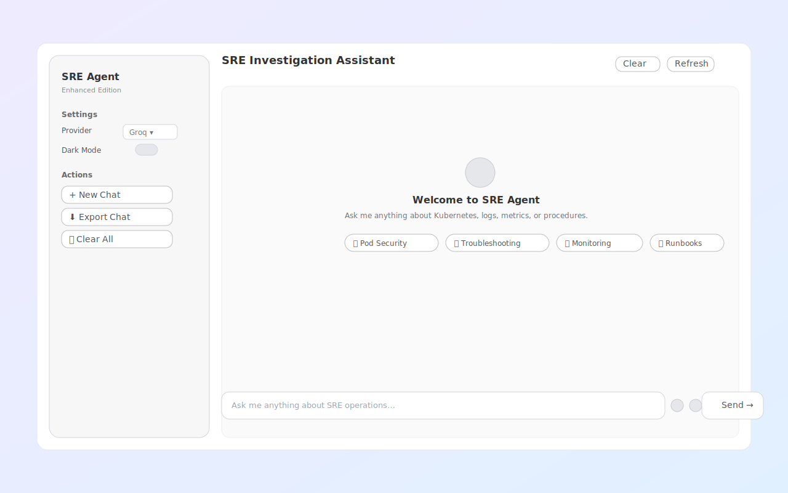
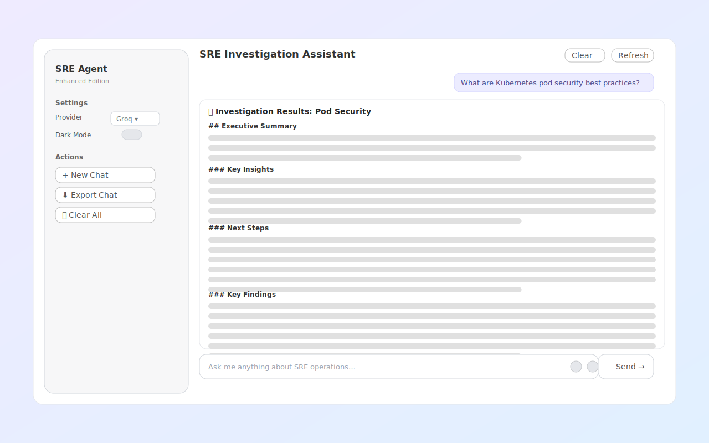
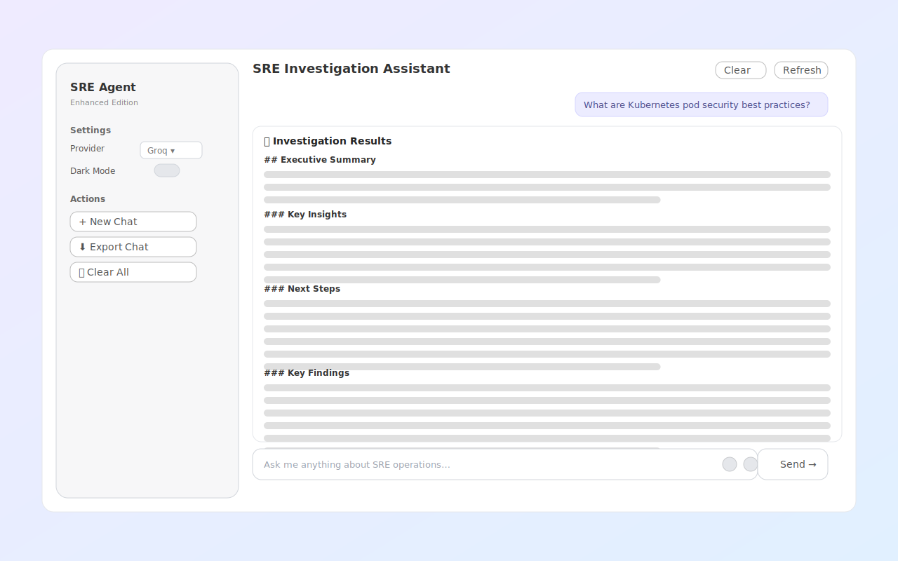

# SRE Agent UI Options

Three ways to interact with the SRE Agent visually:

## Option 1: Swagger UI (Built-in, No Install) ✅

FastAPI automatically generates interactive API documentation:

```bash
# Start the agent runtime
cd /Users/manjunathainti/amazon-sre-agent
uv run uvicorn sre_agent.agent_runtime:app --host 0.0.0.0 --port 8080

# Open in browser:
# http://localhost:8080/docs  ← Swagger UI (test API endpoints)
# http://localhost:8080/redoc ← ReDoc (API documentation)
```

**Pros:**
- No installation needed
- Built into FastAPI
- Good for API testing

**Cons:**
- Not a chat interface
- JSON request/response format

---

## Option 2: Streamlit Chat UI (Simple, Python-based)

Beautiful chat interface using Streamlit:

```bash
# Install Streamlit
uv pip install streamlit

# Run the Streamlit UI
streamlit run ui/streamlit_app.py

# Opens automatically at: http://localhost:8501
```

**Pros:**
- Clean chat interface
- Easy to customize
- Python-based

**Cons:**
- Requires Streamlit installation

---

## Option 3: Pure HTML/JS Web UI (No Dependencies)

Standalone web page that talks to the FastAPI backend:

```bash
# 1. Start the agent runtime (in terminal 1)
uv run uvicorn sre_agent.agent_runtime:app --host 0.0.0.0 --port 8080

# 2. Open the HTML file in your browser (double-click)
open ui/web_ui.html

# Or serve it with Python (in terminal 2)
cd ui
python3 -m http.server 3000
# Then open: http://localhost:3000/web_ui.html
```

**Pros:**
- No Python dependencies
- Works in any browser
- Beautiful gradient design
- Real-time chat interface

**Cons:**
- Requires agent runtime to be running

---

## UI Wireframes & Screenshots

### Welcome Screen
The UI welcomes users with quick action chips for common SRE queries:



**Features:**
- Clean welcome interface
- Quick action chips (Pod Security, Troubleshooting, Monitoring, Runbooks)
- Sidebar with settings and actions
- Provider selection (Groq, Anthropic, Bedrock)

### Investigation Results - Pod Security
Example investigation showing structured results with executive summary:



**Features:**
- User query displayed at top
- Structured markdown results
- Executive Summary section
- Key Insights and Findings
- Next Steps recommendations

### Investigation Results - Runbooks
Example showing how runbook queries are displayed:



**Features:**
- Clean results layout
- Markdown formatting
- Scrollable content area
- Fixed input bar at bottom

---

## Implementation Details

### Swagger UI (Option 1)
- API endpoint testing
- JSON request/response
- Built-in validation

### Streamlit UI (Option 2)
- Clean chat interface
- Conversation history
- Provider selection

### HTML UI (Option 3)
- Modern gradient design
- Real-time responses
- Example queries
- Mobile-friendly
- Implements the wireframe designs shown above

---

## Recommendation

**For Quick Testing:** Use Option 1 (Swagger UI) - no setup needed

**For Best Experience:** Use Option 3 (HTML UI) - beautiful and functional

**For Python Integration:** Use Option 2 (Streamlit) - easy to extend

---

## Adding Features

Want to add features to the UI? Here are some ideas:

1. **Conversation History** - Save/load previous chats
2. **User Authentication** - Login system
3. **File Upload** - Upload logs or configs
4. **Export Reports** - Download markdown reports
5. **Real-time Streaming** - Stream agent responses
6. **Multi-user Support** - User profiles and personalization
7. **Dark Mode** - Toggle theme
8. **Tool Usage Viz** - Show which agents/tools were used

See the Streamlit or HTML files to get started!

